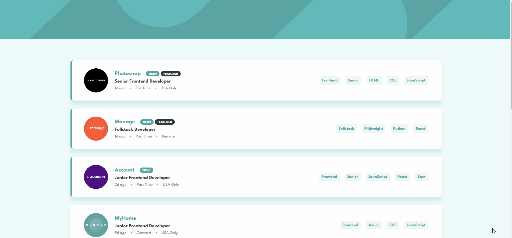
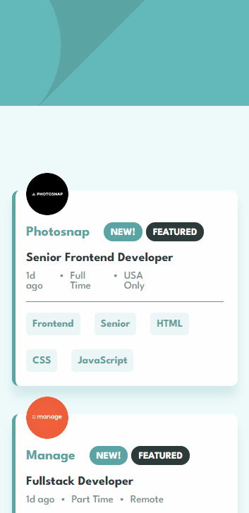

### <div align="center">Choose your language | Escolha seu idioma </div>

<div align="center">

[](https://github.com/edilan-ribeiro/fm-job-listings/blob/main/README.en.md)
[](https://github.com/edilan-ribeiro/fm-job-listings/blob/main/README.md) <br>


</div>
<br>
<a name="readme-top"></a>


<br />
<div align="center">
 <a href="https://github.com/edilan-ribeiro/fm-job-listings">
    
  </a>

<h3 align="center">Job listings with filtering</h3>

  <p align="center">    
    Challenge by FrontEnd Mentor about a page for job listings
  </p>
  
  <a href="https://fm-job-listings-rho.vercel.app/">View Demo</a>
</div>

<br>

<details>
  <summary>Table of Contents</summary>
  <ol>
    <li>
      <a href="#about-the-project">About The Project</a>
      <ul>
        <li><a href="#built-with">Built With</a></li>
        <li><a href="#highlights">highlights</a></li>
        <li><a href="#challenges-and-lessons-learned">Challenges and lessons learned</a></li>
      </ul>
    </li>
    <li><a href="#usage">Usage</a></li>
    <li><a href="#contact">Contact</a></li>
  </ol>
</details>

<br><br>

## About The Project

 

<br>This project allows the user to obtain information about job vacancies and also filter them simply and quickly!




<p align="right">(<a href="#readme-top">back to top</a>)</p>


### Built With

<div align="center">


</div>


<p align="right">(<a href="#readme-top">back to top</a>)</p>


## Highlights

The project is very minimalist in design, but requires a little planning in the filtering logic 👷‍♂️

<p align="right">(<a href="#readme-top">back to top</a>)</p>

## Challenges and lessons learned

🧑‍🎤 1..2...3... Testing, Composition pattern.
The composition pattern in React provides flexibility and code reuse, enabling the construction of complex components by combining smaller components. This approach promotes a modular structure, making the project more scalable.

🤹🏼 Talking a bit about the filter, first it combines the data from the tech stack (position, seniority, languages, and tools). Then, it applies two conditions:

1- Checking if the array of selected items is empty, it passes a new array with all the items from the data file.

2- If the array of selected items is not empty, it compares which tech stack arrays have items that are also present in the selected array. If both are in agreement and have the same number of sub-arrays, a new array is generated with the filtered items. 🧙


In summary, it was possible to learn and practice:
 - Learn React composition pattern
 - Learn a little about React Framer for a small animation
 - Practice Sass more

<p align="right">(<a href="#readme-top">back to top</a>)</p>

## Usage

After cloning, downloading, or forking, use the command below to install the project dependencies:
```shell
npm install
```

This project allows you to:
- Read the job postings (🤷)
- Filter job postings by:

  - Position (frontend, fullstack, backend)
  - Seniority (junior, midweight, senior)
  - Languages (HTML, CSS, JavaScript, Python, Ruby)
  - Tools (React, Sass, RoR, Vue, Django)

<p align="right">(<a href="#readme-top">back to top</a>)</p>

## Contact

💌 To send me a message, just use one of the buttons below!<br>

  <a href = "mailto:edilanbusiness@gmail.com" target="_blank"></a>
  <a href="https://www.linkedin.com/in/edilan-ribeiro-santos" target="_blank"></a> 
  <a href="https://whatsa.me/5561983769634/?t=Hello,%20I%20came%20from%20your%20GitHub!" target="_blank">
  </a>


<p align="right">(<a href="#readme-top">back to top</a>)</p>
